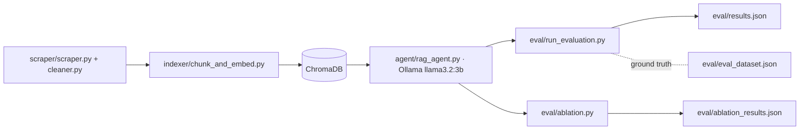

# 732A81 — Text Mining Project: a RAG Ablation Study

A research harness that **evaluates** RAG-pipeline variants for LiU housing Q&A — one RAG agent plus an ablation study over chunking strategies and retrieval parameters, scored against a ground-truth QA set. This was part of the coursework involved in 732A81 Text Mining Course at LiU. It was further modified using Claude Code.


## Why

Most student RAG projects stop at "it answers questions." This one measures *how well* — systematically sweeping chunking and retrieval parameters and scoring answers against a ground-truth QA dataset with BERTScore and ROUGE. The evaluation rigor is the point.

## What it does

- Scrapes and cleans LiU housing content into a corpus.
- Indexes it into ChromaDB with configurable chunking.
- Answers questions via a local Ollama (`llama3.2:3b`) RAG agent.
- Scores answers against a ground-truth QA set (BERTScore + ROUGE).
- Runs an ablation sweep over chunking/retrieval params and records the results.

## Architecture / pipeline



## Stack

- **LangChain** — RAG orchestration.
- **ChromaDB** (port 8000) — vector store.
- **Ollama / llama3.2:3b** (port 11434, GPU) — local LLM, no API cost.
- **sentence-transformers** `all-MiniLM-L6-v2` — embeddings.
- **BERTScore + ROUGE** — answer-quality metrics.

## Run it

```bash
ollama pull llama3.2:3b
# _verify exact script paths against the repo_
python scraper/scraper.py
python indexer/chunk_and_embed.py
python eval/run_evaluation.py     # scores vs eval/eval_dataset.json
python eval/ablation.py           # parameter sweep
```

## Results

Four configurations, sweeping chunk size × overlap × retrieval depth, each scored against the same 45-question ground-truth set (`eval/eval_dataset.json`). Overlap tracks chunk size throughout (500→80, 250→40), so it's folded into the chunk column. Raw numbers in `eval/ablation_results.json`.

| Chunk | top_k | Chunks indexed | ROUGE-1 | ROUGE-2 | ROUGE-L | BERTScore F1 |
|---|---|---|---|---|---|---|
| **500** | **5** | 112 | **0.4642** | **0.3039** | **0.4129** | **0.9088** |
| 250 | 8 | 240 | 0.4475 | 0.2897 | 0.3908 | 0.9047 |
| 250 | 5 | 240 | 0.4287 | 0.2730 | 0.3744 | 0.9036 |
| 500 | 8 | 112 | 0.4228 | 0.2856 | 0.3750 | 0.9017 |

**The surprising result: retrieving more made it worse.** Holding chunking fixed at 500/80 and raising `top_k` from 5 to 8 dropped every metric — ROUGE-1 0.4642 → 0.4228, ROUGE-L 0.4129 → 0.3750, BERTScore 0.9088 → 0.9017. This is the one clean single-variable contrast in the sweep, and it runs against the assumption that more retrieved context can only help; the likely mechanism is that the extra chunks dilute the prompt with near-miss passages the 3B model then has to arbitrate between.

At chunk=250 the same `top_k` bump moved the other way (ROUGE-1 0.4287 → 0.4475), suggesting the governing quantity is *total retrieved context* rather than `k` alone — both mid-budget configs beat both extremes on all four metrics. Four configs and one run each, so treat that as a hypothesis to test, not a result.

**Caveats:** 45 eval questions, single run per config, one local model (`llama3.2:3b`), four configurations. The BERTScore spread across all four is 0.007 — too small to defend the tail of the ranking without additional seeds.

See `report/` for the full academic write-up.

## What I learned

- Evaluating a RAG pipeline is harder than building one — and far more revealing.
- "Retrieve more" is not a free improvement. A higher `top_k` looked like a safe default; at the chunk size I was actually using it degraded every metric. Without the sweep I'd have shipped the worse config on intuition.
- Chunk size and `top_k` don't act independently — the same `k` increase helped at 250-char chunks and hurt at 500. What the model sees is the *product*, not either knob alone.
- A small eval set limits what you're allowed to claim. A 0.007 BERTScore spread over 45 questions is a hypothesis, not a conclusion, and reporting the caveat matters as much as reporting the number.