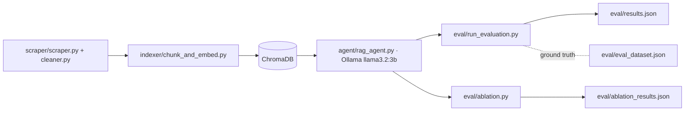

# 732A81 — Text Mining Project: a RAG Ablation Study

A research harness that **evaluates** RAG-pipeline variants for LiU housing Q&A — one RAG agent plus an ablation study over chunking strategies and retrieval parameters, scored against a ground-truth QA set. This was part of the coursework involved in 732A81 Text Mining Course at LiU. It was further modified using Claude Code.


## Why

Most student RAG projects stop at "it answers questions." This one measures *how well* — systematically sweeping chunking and retrieval parameters and scoring answers against a ground-truth QA dataset with BERTScore and ROUGE. The evaluation rigor is the point.

## What it does

- Scrapes and cleans LiU housing content into a corpus.
- Indexes it into ChromaDB with configurable chunking.
- Answers questions via a local Ollama (`llama3.2:3b`) RAG agent.
- Scores answers against a ground-truth QA set (BERTScore + ROUGE).
- Runs an ablation sweep over chunking/retrieval params and records the results.

## Architecture / pipeline



## Stack

- **LangChain** — RAG orchestration.
- **ChromaDB** (port 8000) — vector store.
- **Ollama / llama3.2:3b** (port 11434, GPU) — local LLM, no API cost.
- **sentence-transformers** `all-MiniLM-L6-v2` — embeddings.
- **BERTScore + ROUGE** — answer-quality metrics.

## Run it

```bash
ollama pull llama3.2:3b
# _verify exact script paths against the repo_
python scraper/scraper.py
python indexer/chunk_and_embed.py
python eval/run_evaluation.py     # scores vs eval/eval_dataset.json
python eval/ablation.py           # parameter sweep
```

<!-- ## Results / demo -->

<!-- TODO (high value): a small table — best vs. worst config on BERTScore/ROUGE, plus the one finding that surprised you. This is the most recruiter-credible thing in the repo. -->

<!-- | Config | Chunking | Retrieval k | BERTScore | ROUGE-L |
|---|---|---|---|---|
| Best | _TODO_ | _TODO_ | _TODO_ | _TODO_ |
| Worst | _TODO_ | _TODO_ | _TODO_ | _TODO_ |

See `report/` for the full academic write-up. -->

## What I learned

- Evaluating a RAG pipeline is harder than building one — and far more revealing.
<!-- TODO: the chunking/retrieval trade-off you found, and the surprising result -->